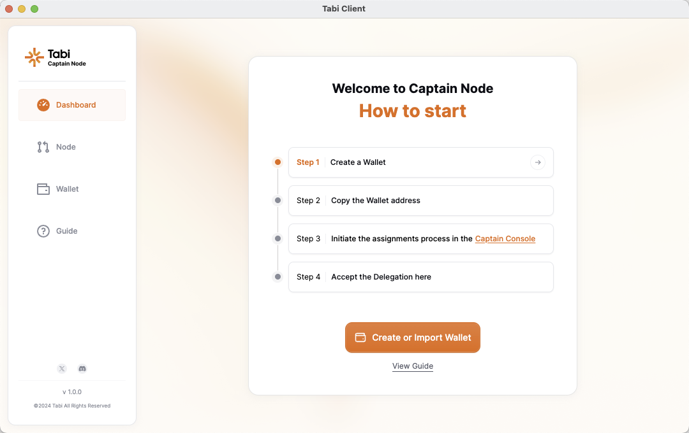

# Get start the node usage tutorial

**Here is the video tutorial link**:⬇️

[https://youtu.be/h8ZVCJupCes](https://youtu.be/h8ZVCJupCes)

**Please download the Tabi Captain Node Console client from our official GitHub.**

We offer clients for all systems: macOS/WIN/Linux

Please select your system and download the Console client.&#x20;

<[https://github.com/tabilabs/tabi-node/releases](https://github.com/tabilabs/tabi-node/releases)>

After installing the **Tabi Captain Node Console**, you will enter the setup interface.

<figure><figcaption></figcaption></figure>

**Step 0: Create a Wallet**First, you need to create or import a wallet, and you will assign your node to this wallet.

<figure><figcaption></figcaption></figure>

For tutorial purposes, we choose to create a wallet.

<figure><figcaption></figcaption></figure>

After creation, you will receive a brand new wallet. **We strongly recommend that you keep your private key safe.**

<figure><figcaption></figcaption></figure>

**Step 1: Copy your wallet address**Please copy your wallet address and enter the Tabi Captain Node Dashboar&#x64;**<**[**https://app.tabichain.com/**](https://app.tabichain.com/)**>**

<figure><figcaption></figcaption></figure>

**Please connect the&#x20;**_**wallet address with Captain Node**_**&#x20;here and complete the signature.**

<figure><figcaption></figcaption></figure>

After connecting, you will enter the Dashboard interface, where you can see the operating status of all your captain nodes.&#x20;

Let's enter the Node interface to complete the assignment.

<figure><figcaption></figcaption></figure>

In the Node interface, you can see all the Captain Node information owned by your connected wallet. Let's allocate one of the Captain Nodes.&#x20;

(You can assign multiple nodes you own to run on one wallet)

<figure><figcaption></figcaption></figure>

Paste your wallet address in Console client

<figure><figcaption></figcaption></figure>

Click \<Set> to complete the assignment, then let's return to the Console.

\
**Step3 : Initiate the assignments process in the captain console**Return to the Console and enter the Node interface, where we can see the request initiated on the Dashboard. Please click \<Accept> and confirm.

<figure><figcaption></figcaption></figure>

**Now you have completed the binding process of the node,** and we can see that your node has entered the running state in the newly created wallet address.

<figure><figcaption></figcaption></figure>

You can also enter the Dashboard of Console to check the node status.

<figure><figcaption></figcaption></figure>

Or you can check the status of all nodes on the Dashboard website.

<[https://app.tabichain.com/](https://app.tabichain.com/)>

<figure><figcaption></figcaption></figure>

#### **Additional Tutorial: Assign multiple nodes you own to a single address and run them.**

<figure><figcaption></figcaption></figure>

If you have multiple Captain Nodes in your wallet, you can assign them to the same wallet or different wallets simultaneously. Here, I assigned the other 6 Captain Nodes to the wallet I just created.

<figure><figcaption></figcaption></figure>

<figure><figcaption></figcaption></figure>

Let's return to the Console, where you only need to click <**Accept All**> to complete the binding of all nodes.

<figure><figcaption></figcaption></figure>

We can see on the Dashboard that all nodes have started running.

<[https://app.tabichain.com/](https://app.tabichain.com/)>

<figure><figcaption></figcaption></figure>

#### **Notice：**

**Please note that the startup times for Captain Nodes at different tiers vary.** If your Captain Node has not yet reached its startup time, you will see it in a \<Waiting> status after assignment and can check the detailed startup time.&#x20;

**After you complete the assigned node, you only need to keep the node client running. When your node tier reaches the start time, your node will automatically enter the \<running> state.**

<figure><figcaption></figcaption></figure>

#### **Additional Tutorial: How to revoke your Captain Node**

If you want to revoke your captain node, and assign your node to another address, please follow the guide below.

<figure><figcaption></figcaption></figure>

Please enter the Node interface and click the button.

<figure><figcaption></figcaption></figure>

Click and enter Dashboard

<figure><figcaption></figcaption></figure>

You can see the Captain Node you just revoked is able to assign again.
