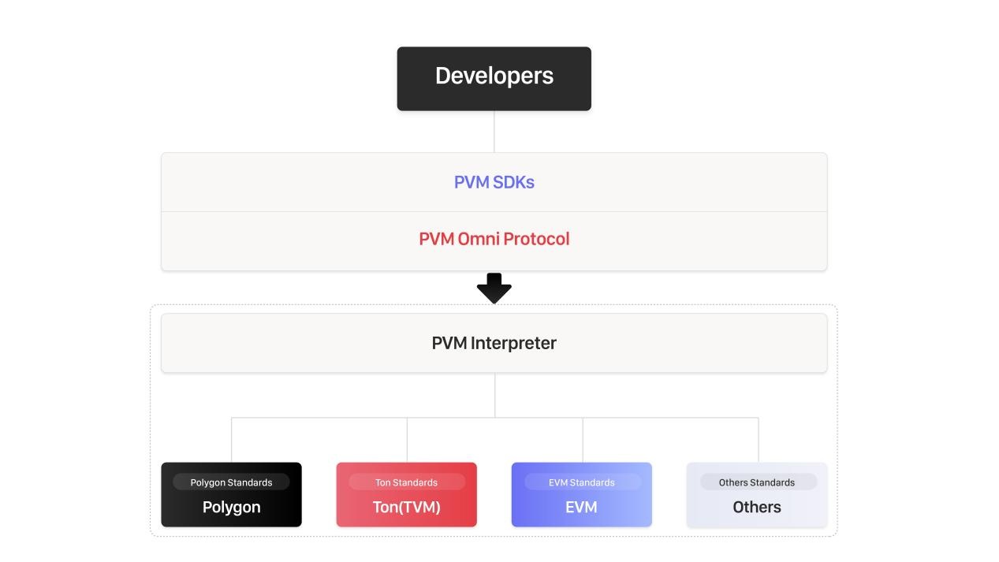
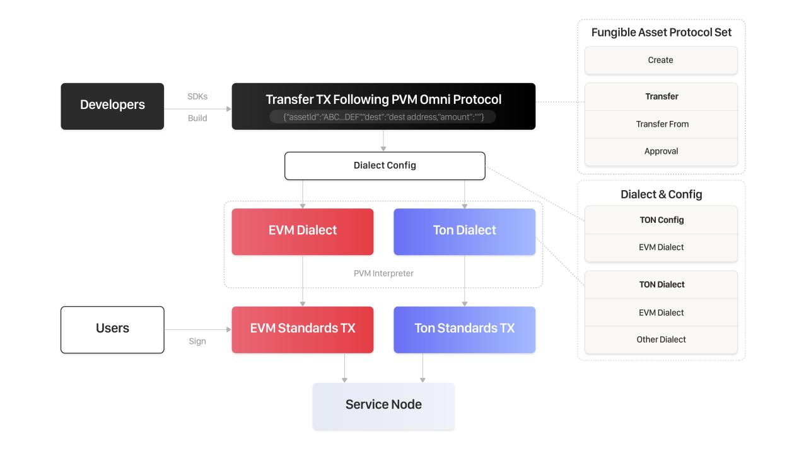

# Background
An obvious way to accelerate the search for the “killer crypto consumer app” is to encourage more Web2 developers who are already experienced and successful in building successful consumer apps at scale to attempt to do so in Web3.
However when Web2 developers want to onboard into Web3, they face the challenge of multiple technical standards, due to the presence of many different blockchains. Even sophisticated Web3 developers may struggle with handling too many kinds of blockchain technical details, and the complexity that comes with multi-chain interactions, let alone someone new to Web3.
<figure><figcaption></figcaption></figure>

The ideal solution is thus for a universal technical standard for Web2 developers to serve as a convenient entry to manipulate various types of blockchains, without requiring to learn multiple Web3 languages from scratch.

# Polymorphic Virtual Machine (PVM)
The PVM provides a universal blockchain FACADE, which can help developers to ignore the difference between blockchains. The only thing that needs to be done by developers is studying PVM-SDKs and PVM Omni Protocol. 
<figure><figcaption></figcaption></figure>

### Universal development platform
PVM is a development platform, which helps Web2 developers move to blockchain, ignoring the technical details.
PVM follows the FACADE design pattern, which makes the difference between blockchains transparent by providing a set of universal APIs. If developers want to switch from a blockchain to another blockchain, the only thing they need to do is change the dialect in config file.
PVM provides Go/Java/JavaScript SDKs to manipulate different blockchains.
<figure><figcaption></figcaption></figure>

### Fee agregation
Fee aggregation is a multi-chain fee solution to simplify the gas processing procedure and to lower on-chain costs. The technologies behind fee aggregation include fee pools, transaction aggregation, state indexer, cross-chain bridge, and oracle.

### PVM Protocol
PVM protocol is a set of universal, human-readable, well structured, extendable protocols, which can be manipulated by SDKs.
PVM protocols are based on popular smart contract use cases, such as fungible assets and non-fungible assets. For a certain smart contract use case, the corresponding protocol covers all the operations. Take a fungible asset as an example. The protocol contains Create, Transfer, Approval, TransferFrom，TotalSupply, BalanceOf, Allowance.

### PVM Interpreter
As we mentioned earlier, developers can initiate transactions that can be executed on various blockchains through the same protocol (PVM protocol). Because the tech details are different from one blockchain to another, we need a component to translate the same protocol into different on chain standards.
So it is reasonable to design a translator component called PVM-Interpreter.
<figure><figcaption></figcaption></figure>

Workflow:
1. Developer configs the dialect and chain info
2. Developer builds a transaction (take transfer of fungible asset as an example), which follows the PVM Omni Protocol.
3. The PVM interpreter will translate the transaction into ton executable on chain transaction.
4. The user signs the transaction.
5. Send the on-chain transaction to service node.
